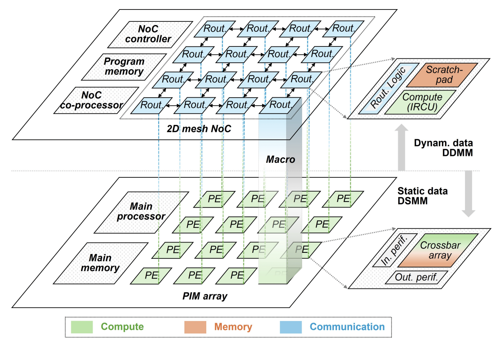

# Maestro Simulator: Mapping File Guide for Llama Results

## Introduction

The Maestro simulator provides a platform to run complex models by simulating their execution across various hardware architectures. The Llama model in particular showcases an optimized framework that utilizes the advanced processing elements (PE) within a PIM (Processing-in-Memory) array and communication via a 2D mesh NoC (Network-on-Chip). Below is an architectural overview of the system, which includes both memory and computation units.



This architecture enables a highly parallel and low-latency processing framework that integrates both static and dynamic data management systems.

## How to Use Mapping File on Maestro Simulator

### 1. **Prerequisites**
   - Download the Maestro Simulato from https://maestro.ece.gatech.edu/docs/build/html/index.html.
   - Ensure you have access to the relevant model and configuration files.
   - The mapping file should be provided in the correct format as specified below.

### 2. **Running the Mapping File**
   To run the mapping file, follow these steps:

   1. **Download the Mapping File**:
      Ensure that the provided mapping file is properly placed within the **`/configs`** directory of the Maestro Simulator.

   2. **Modify Configuration Parameters**:
      Edit the file based on your simulation requirements. Pay attention to parameters such as memory sizes, computational elements, and data communication pathways to optimize performance.

   3. **Execute the Simulation**:
      Once your file is configured, execute the simulation with the following command:
      ```bash
      ./maestro_simulator -c /configs/mapping_file.xml
      ```

   4. **Monitor the Simulation Output**:
      After the simulation runs, output logs will be generated to provide insights into performance, throughput, and latency.

### 3. **Understanding the Dataflow**
   The dataflow section in each layer maps the spatial and temporal computation across the processing units. This step is critical for optimizing performance across the NoC (Network-on-Chip) and ensuring minimal latency for each operation.

   - **Spatial Mapping**: Maps the computations to specific tiles of the PE array.
   - **Temporal Mapping**: Controls the scheduling of tasks across the cycle time.

### 4. **Optimizing Throughput and Latency**
   - Use **Parallelism**: Increase the level of parallelism by adjusting the number of processing elements (PE) and the cluster size.
   - **Memory Size**: Make sure that memory sizes are optimized for the workload to avoid data transfer bottlenecks.

## Conclusion

The mapping file configuration can greatly influence the performance of your simulation on the Maestro platform. By adjusting the layers, memory, and compute settings, you can achieve a high throughput and low latency, maximizing the efficiency of the Llama model on your hardware architecture.

## References

- **LEAP**: [LEAP: LLM Inference on Scalable PIM-NoC Architecture with Balanced Dataflow and Fine-Grained Parallelism](https://arxiv.org/abs/2405.02351)
